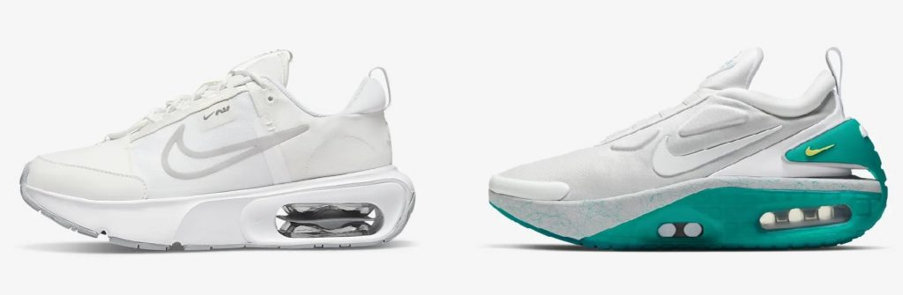

## Non-electronic Nike Adapt Max Alternative

If you like the look of the Nike Adapt Max but either don’t want to pay a couple hundred dollars for them or don’t like the auto lacing technology, you can get the “analog” version: the Nike Air Max INTRLK. It’s obvious from the side by side that these two shoes are directly related. Though I think the Nike Adapt Max looks better, the fact that TSA precheck may flag these shoes and the enormous extra cost of the Adapt Max means I’m going to pick up the INTRLK instead. Note that the INTRLK only comes in women’s sizes but Nike’s product pages all link to a size guide to help you convert to men’s.

---
